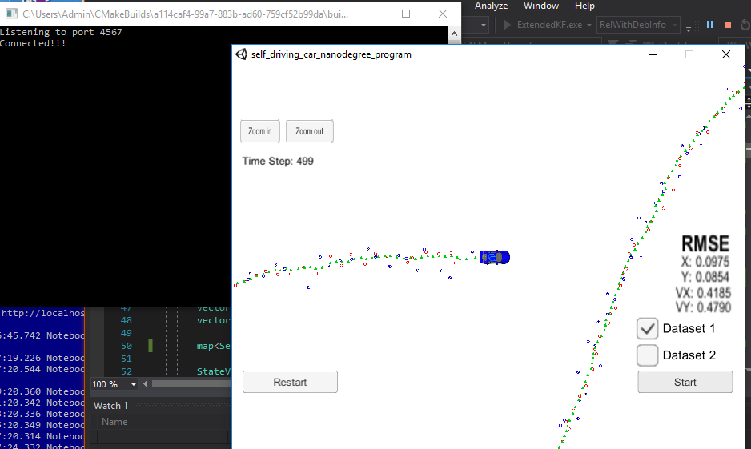
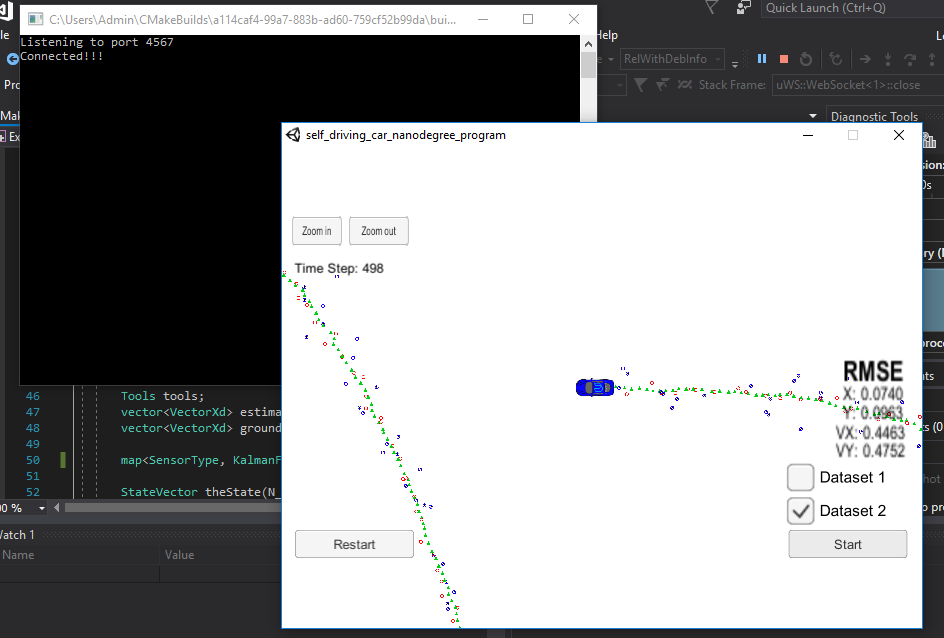

# Extended Kalman Filter Project

In this project we used a Kalman Filter to estimate the state of a moving object of interest with noisy lidar and radar measurements. 


The program main.cpp has already been filled out, but feel free to modify it.

Here is the main protcol that main.cpp uses for uWebSocketIO in communicating with the simulator.


INPUT: values provided by the simulator to the c++ program

["sensor_measurement"] => the measurement that the simulator observed (either lidar or radar)


OUTPUT: values provided by the c++ program to the simulator

["estimate_x"] <= kalman filter estimated position x
["estimate_y"] <= kalman filter estimated position y
["rmse_x"]
["rmse_y"]
["rmse_vx"]
["rmse_vy"]

---

## Other Important Dependencies

* cmake >= 3.5
  * All OSes: [click here for installation instructions](https://cmake.org/install/)
* make >= 4.1 (Linux, Mac), 3.81 (Windows)
  * Linux: make is installed by default on most Linux distros
  * Mac: [install Xcode command line tools to get make](https://developer.apple.com/xcode/features/)
  * Windows: [Click here for installation instructions](http://gnuwin32.sourceforge.net/packages/make.htm)
* gcc/g++ >= 5.4
  * Linux: gcc / g++ is installed by default on most Linux distros
  * Mac: same deal as make - [install Xcode command line tools](https://developer.apple.com/xcode/features/)
  * Windows: recommend using [MinGW](http://www.mingw.org/)

## Basic Build Instructions

1. Clone this repo.
2. Make a build directory: `mkdir build && cd build`
3. Compile: `cmake .. && make` 
   * On windows, you may need to run: `cmake .. -G "Unix Makefiles" && make`
4. Run it: `./ExtendedKF `

## Rubric


1. Project must build.

    The source code for this project where changes were made are found in:
    * CMakeLists.txt
    * main.cpp
    * KalmanFilter.h, KalmanFilter.cpp
    * tools.h and tools.cpp

2. px, py, vx, vy output coordinates must have an RMSE <= [.11, .11, 0.52, 0.52] when using the Dataset 1 obj_pose-laser-radar-synthetic-input.txt"
    The computation of the RMSE was updated, , in the tools.cpp file. 
    ```
    VectorXd Tools::CalculateRMSE(const vector<VectorXd> &estimations, const vector<VectorXd> &ground_truth)
    ```
    Here are the resulting RMSE from running the algorithm on the two datasets.


| Dataset | RSME X  | RSME Y | RSME vx | RSME vy |
|:-------:|:-------:| :-----:|: -----:|: -----:|
| 1| 0.0975|0.0854|0.4185|0.4790|
| 2| 0.0740|0.0963|0.4463|0.4752|





3. Your Sensor Fusion algorithm follows the general processing how as taught in the preceding lessons.
    The algorithm is contained in the source file KalmanFilter.h and KalmanFilter.cpp.

    The processing follows the sample code that was provided. The basic pattern, the parent class, is captured in the class KalmanFilter. 
    There are 3 methods, ProcessMeasurement, Predict and Update following the pattern in the lesson. These are declared as virtual so they can be overridden if a different behavior is needed. 

    ** In the case of RadarKalmanFilter, it overrides the method Update to implement the update needed for the Extended Kalman Filter. This fulfils the modifications needed for the sample code of the UpdateEKF in the original EKFFusion class.**

    Two classes LaserKalmanFilter and RadarKalmanFilter are derived from the parent class. These two classes specialize to the specific sensor that they are named after.


    Additionally, there is a factory class, KalmanFilterFactory, that is responsible for construction the appropriate object based on the particular type of sensor. In this project there were two types of sensor data, so we created these two classes and stored a pointer to these classes in a map that is indexed by the type. Once the type of senors is determined the data is packaged and the appropriate Kalman filter is invoked to process the measurement.

    Here is the code that sets up the filter:
    ```
          map<SensorType, KalmanFilter *> mapSensorsType2KF;

          StateVector theState(N_STATE_VECTOR_DIMENSION);
          StateVector *pTheState = &theState;

          KalmanFilterFactory KTsensorFactory(pTheState);
          mapSensorsType2KF.insert(pair<SensorType, KalmanFilter *>(eLaser, KTsensorFactory.MakeKalmanFilter(eLaser)));
          mapSensorsType2KF.insert(pair<SensorType, KalmanFilter *>(eRadar, KTsensorFactory.MakeKalmanFilter(eRadar)));
    ```

4. Your Kalman Filter algorithm handles the first measurements appropriately. Your algorithm should use the ?rst measurements to initialize the state vectors and covariance matrices.

    The LaserKalmanFilter initializes the state vector with the measured sensor position and the velocities are set to zero since the lasers don't have direct velocity information.
    ```
        if (!_pSV->is_initialized_) {
            //cout << "Laser Kalman Filter Initialization " << endl;
            //set the state with the initial location and zero velocity
            *x_ << measurement_pack.raw_measurements_[0], measurement_pack.raw_measurements_[1], 0, 0;

            _pSV->previous_timestamp_ = measurement_pack.timestamp_;
            _pSV->is_initialized_ = true;
            return;
        }
    ```


    The RadarKalmanFilter transforms radar measurement that are in polar coordinates into their Cartesian form before they are use to populate the initial state vector.
    ```
        if (!_pSV->is_initialized_) {
            //cout << "Kalman Filter Initialization " << endl;
            //set the state with the initial location and zero velocity
            // Convert the first measurement data to initialize the state vector
            // Must convert from polar to Cartesian coordinates
            double r = measurement_pack.raw_measurements_(0);
            double phi = measurement_pack.raw_measurements_(1);
            double rdot = measurement_pack.raw_measurements_(2);

            // Populate state vector
            *x_ << r * cos(phi), r*sin(phi), rdot*cos(phi), rdot*sin(phi);

            // Update timestamp
            _pSV->previous_timestamp_ = measurement_pack.timestamp_;
            _pSV->is_initialized_ = true;
            return;
        }

    ```

5. Your Kalman Filter algorithm first predicts then updates. Upon receiving a measurement after the first, the algorithm should predict object position to the current timestep and then update the prediction using the new measurement.

    This code in captured in the ProcessMeasurement methods for each of the sensor classes. Basically, update the prediction of the state, x (state variable) and P (covariance),  and then update the state based on the new measurement per the Kalman Filter recipe. 

6. Your Kalman Filter can handle radar and lidar measurements.

    As described in the stated diagram above two Kalman Filters are created and each applied appropriate based on the sensor data type:

    From main.cpp line 133,
    ```
                          //Call ProcessMeasurment(meas_package) for Kalman filter
                          mapSensorsType2KF[etype]->ProcessMeasurement(meas_package);
    ```

    Each Kalman Filter class handles its own intialization in the constructor.

    In the method RadarKalmanFilter::Update, the prediction is computed by converting the Cartesian coordinate prediction with into its polar coordinate form, e.g. h(x'), as stated in the lessons.
    
    The class RadarKalmanFilter required the computation of the Jacobian and that is found in the file tools.cpp with the following signature:
    ```
    bool Tools::CalculateJacobian(const VectorXd& x_state, MatrixXd& Hj)
    ```
    When the radius is zero, it will populate the entries were large values are expected with the larges number supported by a double.

7. Your algorithm should avoid unnecessary calculations. This is mostly a "code smell" test. Your algorithm does not need to sacrifice comprehension, stability, robustness or security for speed, however it should maintain good practice with respect to calculations. Here are some things to avoid. This is not a complete list, but rather a fewexamples of inefficiencies.
    * Running the exact same calculation repeatedly when you can run it once, store the value and then reuse the value later.
    * Loops that run too many times.
    * Creating unnecessarily complex data structures when simpler structures work equivalently.
    * Unnecessary control how checks.

    I've removed creation of the identity matrix every time in each invocation of Update.
    For the Laser Kalman Filter, I've removed the computation of the H transpose every time.
